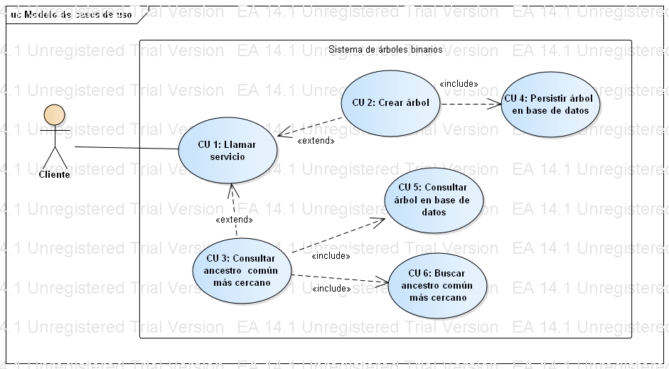
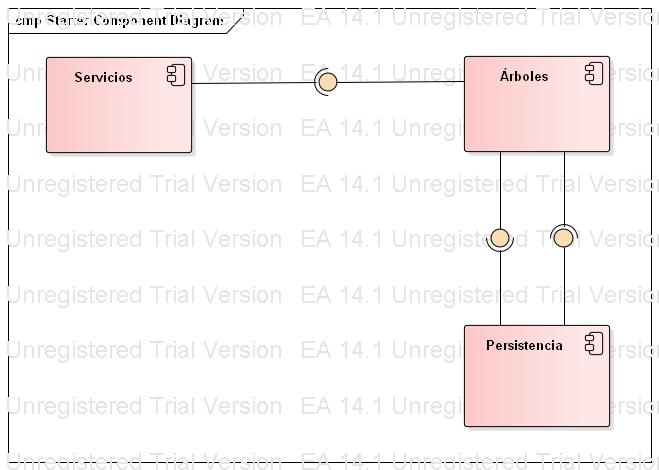
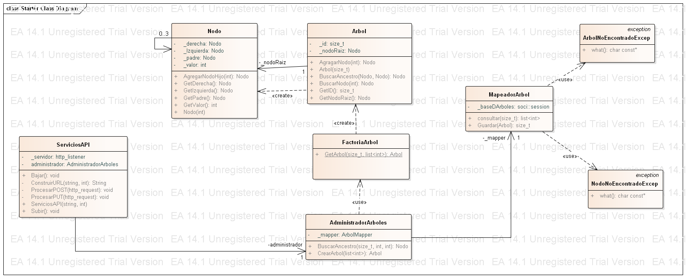

# Prueba_aranda-
prueba técnica desarrollador c++

# Ramas
A continuación se definen las ramas del presente repositorio
* master: Rama por defecto
* releaseV1.0: Rama de la version 1.0
* desarollo: Rama de desarrollo

# Estilo de código
## Clases:
* Estilo CamelCase
* Sustantivos
* Primero miembros public, seguido protected al final private
* Dentro de cada una primero atributos y luego  funciones.

## Funciones/Métodos
* Verbos
* Estilo CamelCase

## Variables/Atributos
* Sustantivos
* Minúsculas separadas por raya piso
* Para atributos privados y protegidos deben iniciar con _

## Includes
* Includes del compilador
* Includes de librerías de terceros
* Includes propios del proyecto

# Configuración para windows
## Instalación de vcpkg
Seguir Instrucciones de acuerdo a la pagina oficial de [vcpkg](https://github.com/microsoft/vcpkg)

Se instalan estos paquetes
* .\vcpkg install sqlite3 sqlite3:x64-windows
* .\vcpkg install boost boost:x64-windows
* .\vcpkg install soci[boost,sqlite3] soci[boost,sqlite3]:x64-windows
* .\vcpkg install cpprestsdk cpprestsdk:x64-windows

Se recomienda ejecutar el siguiente comando
.\vcpkg integrate install

## Clonar repositorio. Debido a que se cuenta con submodulos se debe clonar así

```
git clone --recurse-submodules https://github.com/ingScarpetta/Prueba_aranda-.git
```

## Para compilar

Asumiendo se tenga instalado vcpkg en C:/dev/vcpkg

```
cd Prueba_aranda-
mkdir build
cd build
cmake -DCMAKE_TOOLCHAIN_FILE=C:/dev/vcpkg/scripts/buildsystems/vcpkg.cmake ..
cmake --build .
```

# Diseño y arquitectura

## Casos de uso

A continuación se muestra el diagrama de casos de uso del sistema


## Diagrama de componentes

A continuación se muestra el diagrama de componentes del sistema. Como se obseva se separó el proyecto en tres módulos principales



## Diagrama de clases

A continuación se muestra el diagrama de clases del sistema. Se observan las clases a la izquierda correspondientes al componente Servicios, en el centro al componente  Arboles y a la derecha a Persistencia.



## API

### End point de creación de los árboles

La URL es /crear
El método HTTP aceptado es PUT

Se debe usar el siguiente JSON para crear un árbol.

```
{
	"valores": [1,2,3,3]
}
```

Donde:
* valores es de tipo arreglo de enteros

La respuesta de éxito es:

```
{
	"id": 1
}
```

Los posibles errores son
* Por falta de la llave valores. O porque el tipo de la llave no sea un arreglo
```
{
	"error": "Campo requerido valores de tipo Arreglo"
}
```

* Si algún elemento de lso valores no es entero
```
{
	"error": "Todos los valores deben ser enteros"
}
```

### End point de busqueda de ancestro común a dos nodos de un árbol

La URL es /buscar-ancestro
El método HTTP aceptado es POST

Se debe usar el siguiente JSON para crear un árbol.

```
{
	"id": 1,
	"nodo1": 1,
	"nodo": 1
}
```

Donde:
* id Es de tipo entero
* nodo1 es de tipo entero
* nodo2 es de tipo entero

La respuesta de éxito es:

```
{
	"ancestro": 1
}
```

Los posibles errores son
* Por falta de la llave id. O porque el tipo de la llave no sea un entero
```
{
	"error": "Campo requerido id"
}
```

* Por falta de la llave nodo1. O porque el tipo de la llave no sea un entero
```
{
	"error": "Campo requerido nodo1"
}
```

* Por falta de la llave nodo2. O porque el tipo de la llave no sea un entero
```
{
	"error": "Campo requerido nodo2"
}
```

* Si no se encontró árbol con el id
```
{
	"error": "Arbol no encontrado"
}
```

* Si no se encontró alguno de los dos nodos en el árbol
```
{
	"error": "Nodo no encontrado"
}
```

* Si no se encontró ancestro común más cercano. Posiblemente sea un árbol vacío
```
{
	"error": "No se encontró ancestro común más cercano"
}
```

### Errores comunes
* Si se consulta la URL con el método equivocado
```
{
	"error": "URL No encontrada"
}
```

# Release

 * Se crea un release actual para la versión 1.0.0 para máquinas Windows x64.

## Uso desde la línea de comandos

* Se debe descargar el release y descomprimirlo
* Se debe ingresar por CMD o powershell hasta el .exe
* 80A continuación se debe ejecutar .\PruebaAranda.exe. Por defecto se despliega en el puerto 8080
* Si se desea cambiar el puerto se debe hacer .\PruebaAranda.exe -p [[puerto]] o también .\PruebaAranda.exe --puerto [[puerto]]

# Administración del proyecto

Para el desarrollo del presente proyecto se usó [Trello](https://trello.com/b/CgbKYpLS/prueba-t%C3%A9cnica).

